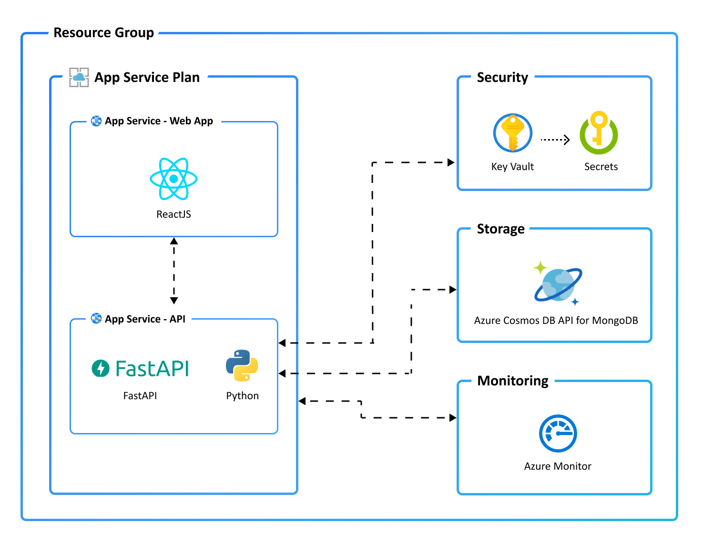

# DIO SRE Workshop

This repo was created based on the Microsoft's template [Azure-Samples/todo-python-mongo-terraform](htps://github.com/Azure-Samples/todo-python-mongo-terraform) to support the DIO SRE Workshop.

# React Web App with Python API and MongoDB (Terraform) on Azure

[](https://codespaces.new/tanure/todo-python-mongo-terraform)
[](https://vscode.dev/redirect?url=vscode://ms-vscode-remote.remote-containers/cloneInVolume?url=https://github.com/tanure/todo-python-mongo-terraform)

The wowkshop is based on a React web app with Python (FastAPI) API and a MongoDB database running on Azure. 


<sup>Screenshot of the deployed ToDo app</sup>

### Prerequisites
> **Please:** To be able to reproduce all tasks mentioned on this repo, first, Firk this repository for your own GitHub account.

> With this repository you're able to create infrastructure and deploy code to Azure. If you don't have an Azure Subscription, you can sign up for a [free account here](https://azure.microsoft.com/free/). Make sure you have *contributor* role to the Azure subscription.


The following prerequisites are required to use this application. Please ensure that you have them all installed locally.

- [Azure Developer CLI](https://aka.ms/azd-install)
- [Python (3.8+)](https://www.python.org/downloads/) - for the API backend
- [Node.js with npm (18.17.1+)](https://nodejs.org/) - for the Web frontend
- [Terraform CLI](https://aka.ms/azure-dev/terraform-install)
    - Requires the [Azure CLI](https://learn.microsoft.com/cli/azure/install-azure-cli)
- [Preparing this repository](docs/README.md)

### Quickstart
This repository use the Azure Developer CLI (azd) as a base tool to interact with the Azure. You'll be able to deploy the complete infrastructure and applications with one command that you'll see soon. However, the practices mentioned here can also be performed without the CLI tool.

Let's prepare your environment running the following commands in your terminal. Make sure you have the administrative priviledge.

The step following commando is necessary to make sure the CLI tool is autheticated on your Azure Subscription:

```bash
# Log in to azd. Only required once per-install.
azd auth login
```

So now you're almost prepared to use the `azd` tool, and now is necessary to execute the following command to download the resources dependencies for the infrastructure, web and api projects. Clone your project in a folder of your machine, open the terminal and execute the following commando:

```bash
# First-time project setup. Initialize a project in the current directory, using this template. 
azd init --template <yourgithubuser>/dio-sre-workshop
```

If you want to deploy the entire environment, API, WEB and Infrastructure, you can run the command below. Everything will be provisioned automatically.
```bash
# Provision and deploy to Azure
azd up -e <NameOfTheEnvironment>
```

If you want to destroy the environment, execute the following command:
```bash
# Provision and deploy to Azure
azd down -e <NameOfTheEnvironment>
```

You can learn more about `azd` architecture in [the official documentation](https://learn.microsoft.com/azure/developer/azure-developer-cli/make-azd-compatible?pivots=azd-create#understand-the-azd-architecture).

This project has 4 main projects:
- Infra: Terraform scripts
- src/Web: React project
- src/api: Python project
- Infra/Infra-example: A short terraform project to learn how to work with the GitActions

### Application Architecture

This application utilizes the following Azure resources:

- [**Azure App Services**](https://docs.microsoft.com/azure/app-service/) to host the Web frontend and API backend
- [**Azure Cosmos DB API for MongoDB**](https://docs.microsoft.com/azure/cosmos-db/mongodb/mongodb-introduction) for storage
- [**Azure Monitor**](https://docs.microsoft.com/azure/azure-monitor/) for monitoring and logging
- [**Azure Key Vault**](https://docs.microsoft.com/azure/key-vault/) for securing secrets

Here's a high level architecture diagram that illustrates these components. Notice that these are all contained within a single [resource group](https://docs.microsoft.com/azure/azure-resource-manager/management/manage-resource-groups-portal), that will be created for you when you create the resources.



### Additional `azd` commands

You can deploy the project's Infra, Web or API separately. On the source of this repo, there is a file called `azure.yaml`. This is the configuration file of the `azd` CLI tool. 
Based on this files you'll see three main groups `infra`, `web`and `api` and you make some changes on these projects, you can use the following command to deploy a specific project:

```bash
# deploying the web application
azd deploy web -e <EnvironmentName>
```
    
## Security

### Roles

This template creates a [managed identity](https://docs.microsoft.com/azure/active-directory/managed-identities-azure-resources/overview) for your app inside your Azure Active Directory tenant, and it is used to authenticate your app with Azure and other services that support Azure AD authentication like Key Vault via access policies. You will see principalId referenced in the infrastructure as code files, that refers to the id of the currently logged in Azure Developer CLI user, which will be granted access policies and permissions to run the application locally. To view your managed identity in the Azure Portal, follow these [steps](https://docs.microsoft.com/azure/active-directory/managed-identities-azure-resources/how-to-view-managed-identity-service-principal-portal).

### Key Vault

This template uses [Azure Key Vault](https://docs.microsoft.com/azure/key-vault/general/overview) to securely store your Cosmos DB connection string for the provisioned Cosmos DB account. Key Vault is a cloud service for securely storing and accessing secrets (API keys, passwords, certificates, cryptographic keys) and makes it simple to give other Azure services access to them. As you continue developing your solution, you may add as many secrets to your Key Vault as you require.

